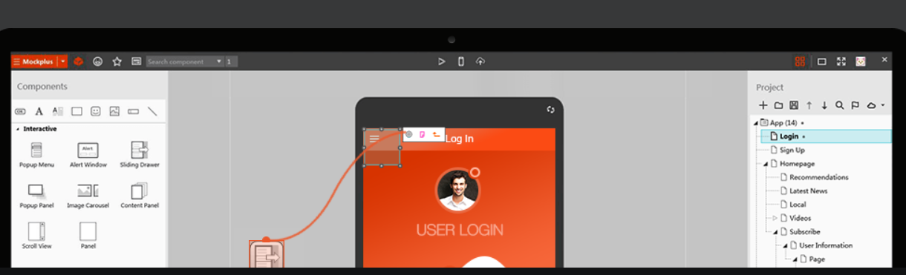
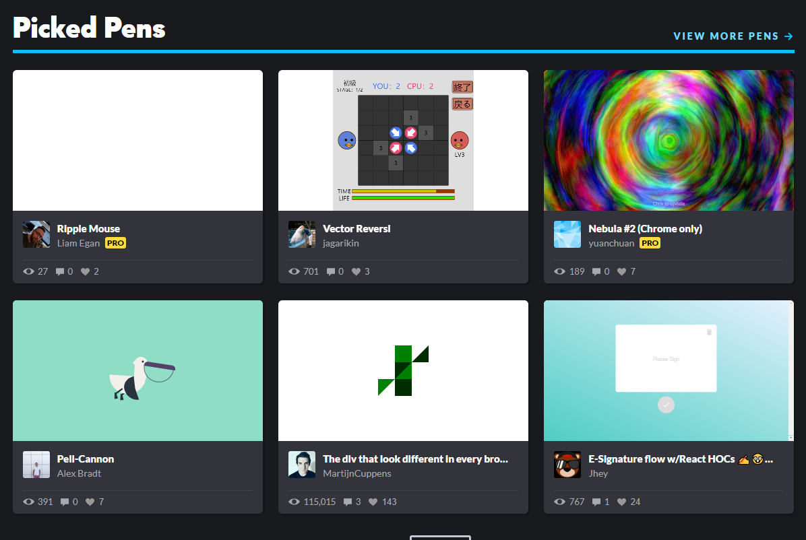

# Account

##Mockplus

   **下载链接**：https://www.mockplus.cn/download

   >国产的更快更简单的原型设计工具 
   >
   >有付费功能，个人最低成本199每年，699不限时

*注册备注：使用的邮箱是葡萄的邮箱，需要手机验证，用的大熊猫的手机号做的验证*

## Codepen

**网站地址：**https://codepen.io/

> 前端开发必备的代码托管、在线编辑、即时预览的工具

*注册备注： 使用的邮箱是葡萄的邮箱，第三方授权登录使用的是github的账号* 

## csdn

网站地址：https://www.csdn.net/

> 专业IT技术社区
>
> 在这里写博客呦，及时记录呦

*注册备注： 使用的邮箱是葡萄的邮箱*

