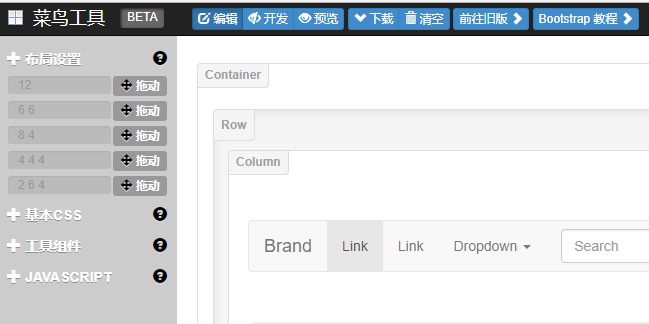
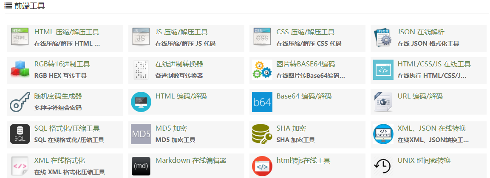
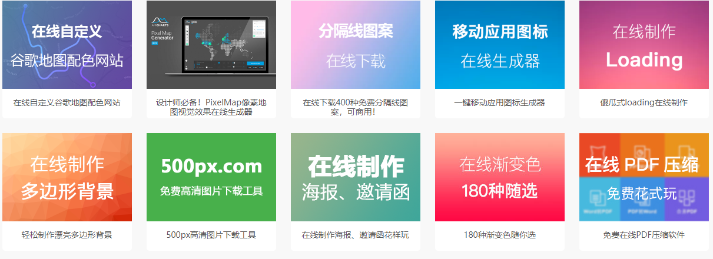

# Accumulate

## Online tools  

1.  bootstrap  在线布局    

   **链接**：http://www.runoob.com/try/bootstrap/layoutit/

   **图片：**

   

   ​

> 通过拖拽快速将布局构思成型   
>
> 可以拿来当成原型工具使用.......

2.菜鸟工具一览  

​    **链接：** https://c.runoob.com/  

​    **图片：**

   

> 能用工具解决的就用，提升效率  

3.快速生成placeholder 图片

**链接：** https://placeholder.com

> 生成任意宽高的 灰色图片，图片上带尺寸信息，没有ps软件的时候，这个可以暂时顶上。

4.学UI网，在线小工具

**链接**：http://www.xueui.cn/design/online-tools

> 诸多在线图片制作工具  

其中一个"在线制作海报，邀请函"的网站挺好玩的

**链接**：https://www.fotor.com.cn/

